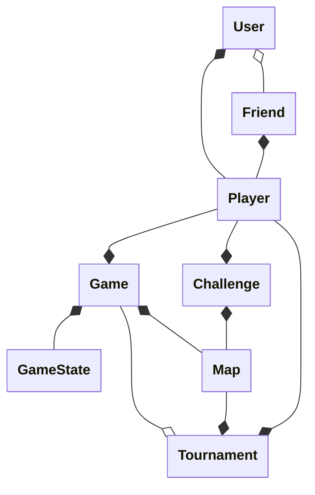

# FT_TRANSCENDENCE
Lucy in the Sky with JavaScript

## Model
Plain objects for communication between modules

```mermaid
---
config:
  class:
    hideEmptyMembersBox: true
---
classDiagram
direction TB
    User *-- Player
    User o-- Friend
    Friend *-- Player
    Player --* Game
    Tournament *-- Player
    Game *-- GameState
    Game --o Tournament
    Map --* Tournament
    Player --* Challenge
    Game *-- Map
    Challenge *--Map
```

