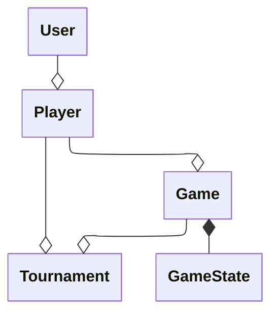

# FT_TRANSCENDANCE
Lucy in the Sky with JavaScript

## Model

```mermaid
---
config:
  class:
    hideEmptyMembersBox: true
  layout: elk
---
classDiagram
direction TB
    class User {
    }
    class Player {
    }
    class Game {
    }
    class Tournament {
    }
    class GameState {
    }

    User --o Player
    Player --o Game
    Tournament o-- Player
    Game *-- GameState
    Game --o Tournament
```
